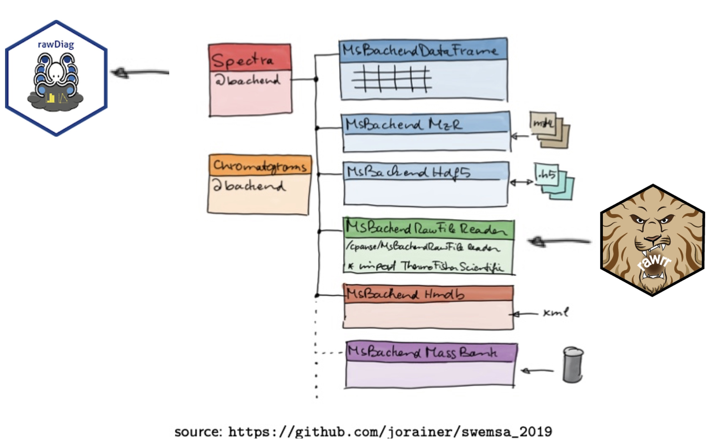

```{r style, echo = FALSE, results = 'asis'}
BiocStyle::markdown()
knitr::opts_chunk$set(fig.wide = TRUE, fig.retina = 3)
```

```{r arch, echo=FALSE, out.width="80%", eval=TRUE, fig.cap="Integration of rawDiag and rawrr into the Spectra ecosystem (by courtesy of Johannes Rainer)."}
  
```

# Requirements

```{r require}
suppressMessages(
  stopifnot(require(Spectra),
            require(MsBackendRawFileReader),
            require(tartare),
            require(BiocParallel))
)
```

assemblies aka Common Intermediate Language bytecode 
The download and install can be done on all platforms using the command:
`rawrr::installRawFileReaderDLLs()`

```{r installAssemblies, echo=TRUE}
if (isFALSE(rawrr::.checkDllInMonoPath())){
  rawrr::installRawFileReaderDLLs()
}

if (isFALSE(file.exists(rawrr:::.rawrrAssembly()))){
 rawrr::installRawrrExe(sourceUrl = "http://fgcz-ms.uzh.ch/~cpanse/rawrr/rawrr.1.1.12.exe")
}
```


# Load data

```{r tartareEH4547, warning=FALSE, message=FALSE, eval=TRUE}
# fetch via ExperimentHub
library(ExperimentHub)
eh <- ExperimentHub::ExperimentHub()
```

```{r tartare}
query(eh, c('tartare'))
```

The RawFileReader libraries require a file extension ending with `.raw`.

```{r EH3220, message=FALSE, warning=FALSE}
EH3220 <- normalizePath(eh[["EH3220"]])
(rawfileEH3220 <- paste0(EH3220, ".raw"))
if (!file.exists(rawfileEH3220)){
  file.link(EH3220, rawfileEH3220)
}

EH3222 <- normalizePath(eh[["EH3222"]])
(rawfileEH3222 <- paste0(EH3222, ".raw"))
if (!file.exists(rawfileEH3222)){
  file.link(EH3222, rawfileEH3222)
}

EH4547  <- normalizePath(eh[["EH4547"]])
(rawfileEH4547  <- paste0(EH4547 , ".raw"))
if (!file.exists(rawfileEH4547 )){
  file.link(EH4547 , rawfileEH4547 )
}
```

# Usage

Call the constructor

```{r backendInitializeMsBackendRawFileReader, message=FALSE}
beRaw <- Spectra::backendInitialize(
  MsBackendRawFileReader::MsBackendRawFileReader(),
  files = c(rawfileEH3220, rawfileEH3222, rawfileEH4547))
```

Call the print method

```{r show}
beRaw
```

# Application example

## Peptide Identification

Here we reproduce the Figure 2 of @rawrr `r BiocStyle::Biocpkg("rawrr")`.
The `r BiocStyle::Githubpkg("fgcz/MsBackendRawFileReader")` ships with a 
`filterScan` method  using functionality provided by the C# libraries by 
Thermo Fisher Scientific @rawfilereader.

```{r rawrrFigure2, fig.cap = "Peptide spectrum match. The vertical grey lines indicate the *in-silico* computed y-ions of the peptide precusor LGGNEQVTR++ as calculated by the [protViz]( https://CRAN.R-project.org/package=protViz) package."}
(S <- (beRaw |>  
   filterScan("FTMS + c NSI Full ms2 487.2567@hcd27.00 [100.0000-1015.0000]") )[437]) |> 
  plotSpectra()

# supposed to be scanIndex 9594
S

# add yIonSeries to the plot
(yIonSeries <- protViz::fragmentIon("LGGNEQVTR")[[1]]$y[1:8])
names(yIonSeries) <- paste0("y", seq(1, length(yIonSeries)))
abline(v = yIonSeries, col='#DDDDDD88', lwd=5)
axis(3, yIonSeries, names(yIonSeries))
```


## Class extension

For demonstration reasons, we extent the `MsBackend` class by a filter method.
The `filterIons` function returns spectra if and only if all fragment ions,
given as argument, match. We use `r BiocStyle::CRANpkg("protViz")``::findNN`
binary search
method for determining the nearest mZ peak for each ion.
If the mass error between an ion and an mz value is less than the given mass
tolerance, an ion is considered a hit.
 
```{r defineFilterIon}
setGeneric("filterIons", function(object, ...) standardGeneric("filterIons"))

setMethod("filterIons", "MsBackend",
  function(object, mZ=numeric(), tol=numeric(), ...) {
    
    keep <- lapply(peaksData(object, BPPARAM = bpparam()),
                   FUN=function(x){
       NN <- protViz::findNN(mZ, x[, 1])
       hit <- (error <- mZ - x[NN, 1]) < tol & x[NN, 2] >= quantile(x[, 2], .9)
       if (sum(hit) == length(mZ))
         TRUE
       else
         FALSE
                   })
    object[unlist(keep)]
  })
```

The lines below implement a simple targeted peptide search engine.
The R code snippet takes as input a `MsBackendRawFileReader` object
containing `r length(beRaw)` spectra and y-fragment-ion mZ values determined 
for `LGGNEQVTR++`.

```{r applyFilterIons}
start_time <- Sys.time()
X <- beRaw |> 
  MsBackendRawFileReader::filterScan("FTMS + c NSI Full ms2 487.2567@hcd27.00 [100.0000-1015.0000]") |>
  filterIons(yIonSeries, tol = 0.005) |> 
  Spectra::Spectra() |>
  Spectra::peaksData() 
end_time <- Sys.time()
```

The defined `filterIons` method runs on 
`r length(beRaw |> MsBackendRawFileReader::filterScan("FTMS + c NSI Full ms2 487.2567@hcd27.00 [100.0000-1015.0000]"))` input spectra and returns `r length(X)` spectra.

The runtime is shown below.
```{r runTime}
end_time - start_time
```

Next, we define and apply a method for graphing `LGGNEQVTR` peptide spectrum
matches. Also, the function returns some statistics of the match.

```{r definePlotLGGNEQVTR}
## A helper plot function to visualize a peptide spectrum match for 
## the LGGNEQVTR peptide.
.plot.LGGNEQVTR <- function(x){
  
  yIonSeries <- protViz::fragmentIon("LGGNEQVTR")[[1]]$y[1:8]
  names(yIonSeries) <- paste0("y", seq(1, length(yIonSeries)))
  
  plot(x, type = 'h', xlim = range(yIonSeries))
  abline(v = yIonSeries, col = '#DDDDDD88', lwd=5)
  axis(3, yIonSeries, names(yIonSeries))
  
  # find nearest mZ value
  idx <- protViz::findNN(yIonSeries, x[,1])
  
  data.frame(
    ion = names(yIonSeries),
    mZ.yIon = yIonSeries,
    mZ = x[idx, 1],
    intensity = x[idx, 2]
  )
}
```

```{r filterIons2, fig.height=8, fig.cap = "Visualizing of the LGGNEQVTR spectrum matches.", echo=FALSE}
op <- par(mfrow=c(4, 1), mar=c(4,4,4,1))
rv <- X |>
  lapply(FUN = .plot.LGGNEQVTR) |>
  Reduce(f=rbind) 
```


```{r sanityCheck}
stats::aggregate(formula = mZ  ~ ion, FUN = base::mean, data=rv)
stats::aggregate(formula = intensity ~ ion, FUN = base::max, data=rv)
```

For the sake of demonstration we apply the `Spectra::combinePeaks` method and
aggregate the `r length(X)` spectra into a singe peak matrix.

The statistics returned by `.plot.LGGNEQVTR()` should be identical with the
output of the aggregation code snippet above.

```{r combinePeaks, fig.cap = "Combined LGGNEQVTR peptide spectrum match plot."}
X |>
  Spectra::combinePeaks(ppm=10, intensityFun=base::max) |>
  .plot.LGGNEQVTR()
```

## Export Mascot Generic Format File

Below we demonstrate the interaction with the `r Biocpkg('MsBackendMgf')` package while composing
a Mascot Generic Format [mgf](http://www.matrixscience.com/help/data_file_help.html#GEN) file.

```{r mgf}
map <- c(scanType = "TITLE",
         msLevel = "CHARGE",
         scanIndex = "SCANS",
         precursorMz = "PEPMASS",
         rtime = "RTINSECONDS")

(mgf <- tempfile(fileext = '.mgf'))

(beRaw |>
  filterScan("FTMS + c NSI Full ms2 487.2567@hcd27.00 [100.0000-1015.0000]") )[437] |>
  Spectra() |>
  MsBackendMgf::export(backend = MsBackendMgf::MsBackendMgf(),
                       file = mgf, map = map)
readLines(mgf) |> head(12)
```

```{r mgfTail}
readLines(mgf) |> tail()
```


To extract all tandem spectra you can use the code snippets below

```{r allMS2}
S <- Spectra::backendInitialize(
  MsBackendRawFileReader::MsBackendRawFileReader(),
  files = c(rawfileEH4547)) |>
  Spectra() 

S
```

```{r writeMGF, eval=FALSE}
S |>
  MsBackendMgf::export(backend = MsBackendMgf::MsBackendMgf(),
                       file = mgf,
                       map = map)
```

## Procesing queue

Given the task, we want to filter an MS2 of peak list recorded on an Orbitrap device to be interested only in the top peak within 100 Da mass windows. The following code snippet will 
demonstrate a solution.

```{r defineTopN}
## Define a function that takes a matrix as input and derives
## the top n most intense peaks within a mass window.
## Of note, here, we require centroided data. (no profile mode!)
top_n <- function(x, n = 10, mass_window = 100, ...){

   idx <- lapply(seq(0, 2000, by = mass_window), function(mZ){
       i <- (mZ < x[, 1] & x[, 1] <= mZ + mass_window) |> which()

       r <- i[order(x[, 2][i], decreasing = TRUE)]

       if (length(x[, 2]) > length(i))
           return(r[1:n])

       return(r)
    }, ...) |> unlist()

   x[idx[!is.na(idx)] |> sort(), ]
}
```

We add our custom code to the processing queue of the Spectra object.
Of note, we use `n = 1` in praxis `n = 10` for a 100 Da mass window, which seems to be a practical choice.

```{r applyProcessing}
S_2 <- Spectra::addProcessing(S, top_n, n = 1) 
```

The plot below displays a visual control of the custom filter function `top_n.`  On the top is the original spectrum, and the filtered one on the bottom. A point indicates peaks that match.

```{r plotSpectraMirror9594, fig.retina=3, fig.cap = "Spectra mirror plot of the filtered and unfiltered (bottom) scan 9594."}
Spectra::plotSpectraMirror(S[9594], S_2[9594], ppm = 50)
```

The next snippet prints the values of the filtered peaklist and the mZ values of the y-ions.

```{r compare9594mZValues}
S_2[9594] |> mz() |> unlist()
yIonSeries
```


# Evaluation

## Efficiency - I/O Benchmark

When reading spectra the
`MsBackendRawFileReader:::.RawFileReader_read_peaks`
method is calling the 
`rawrr::readSpectrum`
method.

The figure below displays the time performance for reading a single spectrum in
dependency from the chunk size (how many spectra are read in one function call)
for reading different numbers of overall spectra.

```{r readBenchmarkData, fig.cap="I/O Benchmark. The XY plot graphs how many spectra the backend can read in one second versus the chunk size of the rawrr::readSpectrum method for different compute architectures."}

ioBm <- file.path(system.file(package = 'MsBackendRawFileReader'),
               'extdata', 'specs.csv') |>
  read.csv2(header=TRUE)

# perform and include a local IO benchmark
ioBmLocal <- ioBenchmark(1000, c(32, 64, 128, 256), rawfile = rawfileEH4547)


lattice::xyplot((1 / as.numeric(time)) * workers ~ size | factor(n) ,
                group = host,
                data = rbind(ioBm, ioBmLocal),
                horizontal = FALSE,
		scales=list(y = list(log = 10)),
                auto.key = TRUE,
                layout = c(3, 1),
                ylab = 'spectra read in one second',
                xlab = 'number of spectra / file')
```

## Effectiveness

We compare the output of the Thermo Fischer Scientific raw files versus
their corresponding mzXML files using `Spectra::MsBackendMzR` relying on the
`r BiocStyle::Biocpkg("mzR")` package.

```{r mzXML}
mzXMLEH3219 <- normalizePath(eh[["EH3219"]])
mzXMLEH3221 <- normalizePath(eh[["EH3221"]])
```

```{r backendInitialize, message=FALSE, fig.cap='Aggregated intensities mzXML versus raw of the 1st 100 spectra.', message=FALSE, warning=FALSE}
if (require(mzR)){
  beMzXML <- Spectra::backendInitialize(
    Spectra::MsBackendMzR(),
    files = c(mzXMLEH3219))
  
  beRaw <- Spectra::backendInitialize(
    MsBackendRawFileReader::MsBackendRawFileReader(),
    files = c(rawfileEH3220))
  
  intensity.xml <- sapply(intensity(beMzXML[1:100]), sum)
  intensity.raw <- sapply(intensity(beRaw[1:100]), sum)
  
  plot(intensity.xml ~ intensity.raw, log = 'xy', asp = 1,
    pch = 16, col = rgb(0.5, 0.5, 0.5, alpha=0.5), cex=2)
  abline(lm(intensity.xml ~ intensity.raw), 
  	col='red')
}
```

Are all scans of the raw file in the mzXML file?

```{r}
if (require(mzR)){
  table(scanIndex(beRaw) %in% scanIndex(beMzXML))
}
```

# Session information {-}

```{r sessionInfo}
sessionInfo()
```

# References {-}
